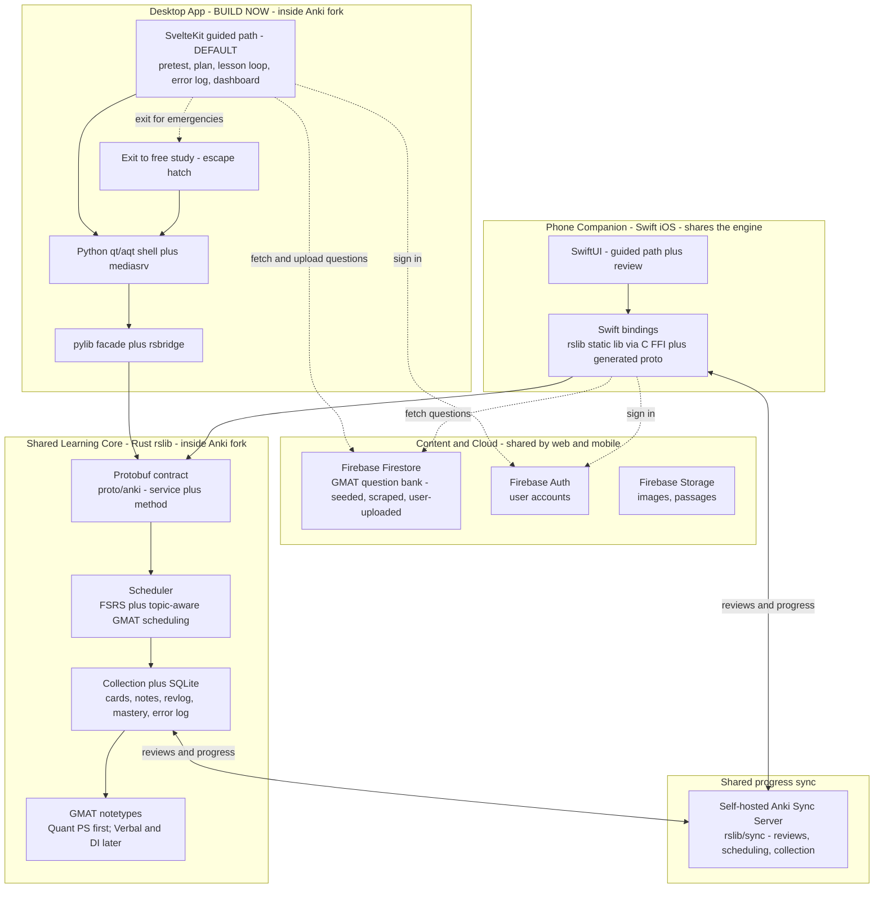
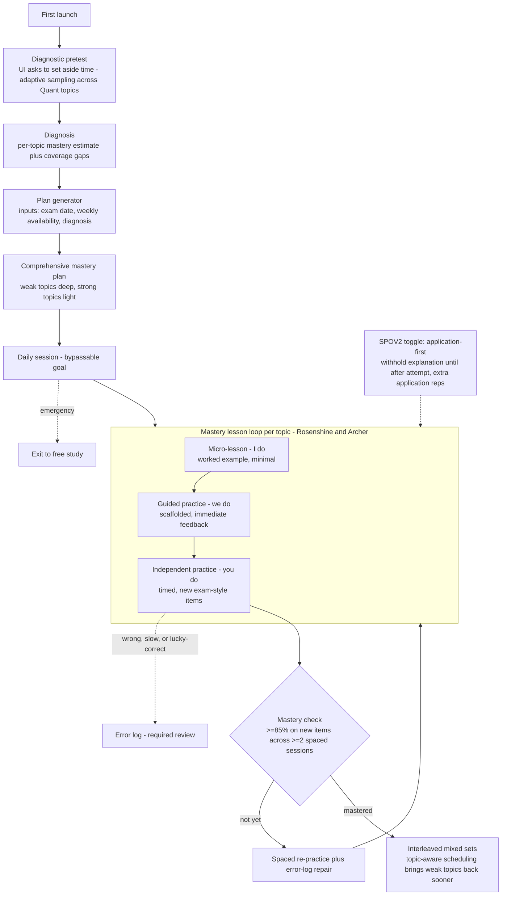
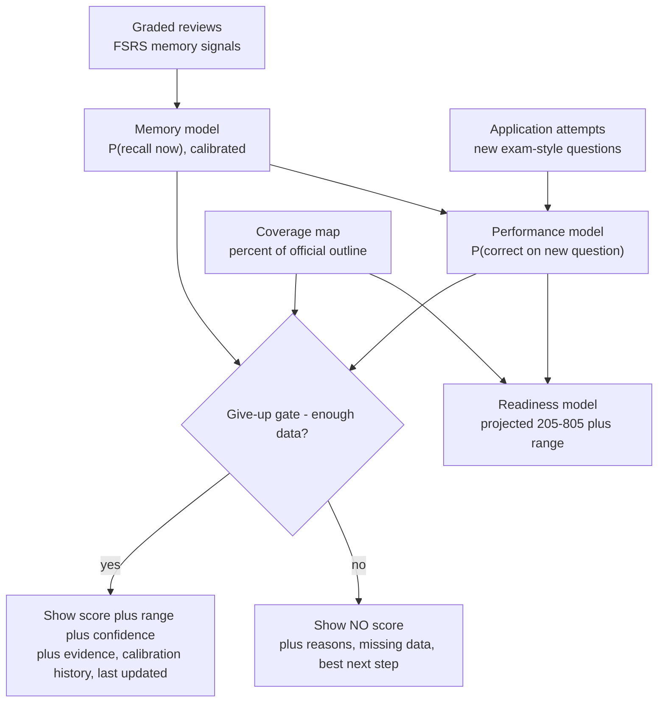

# GMATWiz - Product Requirements Document (PRD)

Status: Draft v1 (planning). Owner: Akash Chintakindi.
Repo (brownfield fork of Anki): `/Users/akashchintakindi/Documents/AlphaProjects/GMATWiz/anki-fork`
Companion engineering reference: [context.txt](context.txt) (codebase map produced before this PRD).

> This document is a plan. No code is written yet. It encodes confirmed decisions and the build it implies.

---

## 1. Vision

GMATWiz is a GMAT (Focus Edition) prep app built **inside a fork of Anki**, not as a layer on top of it. We reuse and extend Anki's proven learning-science engine - spaced repetition, delayed recall, FSRS memory modeling - and turn it from a flashcard scheduler into a **structured GMAT competence engine**.

The product ships as **two apps that share one engine**: a desktop app (primary) and a phone companion (iOS/Swift), both running the same Rust backend, with reviews and progress syncing between them.

We make three honest, separately-reported claims - **Memory**, **Performance**, and **Readiness** - each with a range and an explicit "we don't know yet" rule. A confident number with no evidence behind it is treated as a failure, not a feature.

---

## 2. Founding principles (from the GMAT Brainlift)

These two SPOVs drive every design and architecture decision below.

- **SPOV 1 - Structure is the product.** "The problem is not content, motivation, or difficulty. The problem is learning structure." The app must decide what to do next, when to review, when to slow down, when to advance, and when to simulate the exam. (Rosenshine; Clark/Kirschner/Sweller; Bloom/Guskey mastery learning; Black & Wiliam formative assessment; Gagne's nine events.)
- **SPOV 2 - Application over lessons.** "'Learning' the content does not mean anything. Application is everything. Lessons create confidence; application creates competence." Every lesson is incomplete until the learner has practiced, retrieved after delay, repaired mistakes, and demonstrated the skill in mixed conditions. (Dunlosky 2013; Roediger & Karpicke; Karpicke & Roediger, Science.) **SPOV 2 is implemented as a toggleable feature** (the ablation target in Section 14).

Supporting commitments pulled from the Brainlift:
- Diagnostic **pretest first**, then a personalized, **mastery-based** plan (2-3 months is the consensus window for a strong score).
- **Error logs are required**, not optional, and students must review them; capture *why* a miss happened and what to do next time.
- **Official questions are scarce** - reserve them for late-stage checkpoints; learn on non-official/authored/scraped content.
- **I do -> we do -> you do** (worked example -> guided -> independent), high structure first, faded later; ~85% accuracy before independent practice (Archer).
- **Anti-grind**: autonomous motivation, low cognitive load, one clear next action, bypassable daily goals, sleep/burnout awareness.

---

## 3. Goals and non-goals

### MVP goals
- Anki forked and building from source (desktop) and the same Rust engine running on a phone build.
- One **real Rust engine change** end to end: **topic-aware scheduling** (Section 7), with 3 Rust unit tests + 1 Python test, undo intact, no corruption.
- A review loop running on a **GMAT Quant (Problem Solving)** deck.
- A **Memory** model with an **honest** display: point estimate + range + the give-up rule.
- A desktop **installer** that runs on a clean machine.
- A phone app that builds/runs on a real device or emulator, loads the same deck, and runs a real review session on the shared engine (two-way sync not required for MVP; reviewing the same deck is).
- Proof: commit hash, clean-build recording, test results, clean-machine run.

### Full-product goals (post-MVP, architected for now)
- All three scores (Memory, Performance, Readiness) with ranges and the give-up rule, on both platforms.
- Two-way sync with a stated conflict rule; offline-first.
- Lesson-structure engine (pretest -> diagnosis -> plan -> mastery loop) with error logs.
- Coverage map across the official Quant outline; abstain when below threshold.
- Reproducible held-out evaluation, ablation test of SPOV 2, paraphrase test, leakage check, crash/offline tests, one-command benchmark.

### Non-goals (now)
- **No AI features yet.** Architect clean seams so AI plugs in later; everything must run with AI off.
- No MBA admissions content.
- Not all three GMAT sections at MVP (Quant first; Verbal + Data Insights later).
- Geometry and Sentence Correction are **out of scope entirely** (removed in GMAT Focus Edition).

---

## 4. The three questions = three separate scores

Mixing these is the easiest way to fail. They are different questions and get **separate** displays with ranges.

- **Memory** - "Can the student recall this fact right now?" Anki's FSRS already estimates this well. We must show it is **calibrated**.
- **Performance** - "Can the student answer a *new*, exam-style question that uses this fact, including ones never seen?" This is the first hard bridge.
- **Readiness** - "What score would the student get today, and how sure are we?" Projected on the real GMAT Focus scale (**205-805**, 10-pt increments), with a range and a confidence note. This is the second hard bridge.

### The honesty rule (hard requirement)
No score is shown unless it also shows: (1) the evidence behind it, (2) what data is still missing, (3) how accurate past guesses were (calibration history), (4) the **range** of likely scores (not one number), and (5) the single best next thing to study. Every score carries: point estimate, likely range, % of exam covered, a "how sure" indicator, last-updated timestamp, the main reasons, and the give-up rule.

Example readiness display (target):
> Projected GMAT (Quant): 78th pct - Likely range: 71st-83rd - Confidence: low (you've covered 42% of Quant topics).

### The give-up / abstention rule (CONFIRMED, adopted)
The app shows **no score** when it lacks data, and instead shows reasons + the best next step.

- **Memory**: overall shown at **>= 150 graded reviews**; per-topic memory shown at **>= 20 reviews** in that topic.
- **Performance**: overall shown at **>= 50 graded application (new exam-style) attempts**; per-topic at **>= 8** application attempts.
- **Readiness**: shown only if **all** hold:
  - topic **coverage >= 50%** of the official Quant outline, AND
  - **>= 200** graded reviews, AND
  - **>= 50** application attempts, AND
  - memory **calibration error (ECE) <= 0.10**.
- Otherwise: abstain, list which conditions are unmet, and surface the single best next action.

> MVP note: only **Memory** must display honestly at MVP. Performance and Readiness exist but **abstain** until their thresholds are met - which is itself a correct, scored behavior under the honesty rule.

---

## 5. Target exam and MVP scope

**Exam:** GMAT Focus Edition - 2h15m, 64 questions, 3 sections, no AWA, section-order choice, bookmark/review, up to 3 answer changes per section.
- Quantitative Reasoning: 21 Q / 45 min - **Problem Solving only** (arithmetic + algebra; **no geometry, no Data Sufficiency**).
- Verbal Reasoning: 23 Q / 45 min - **Reading Comprehension + Critical Reasoning** (no Sentence Correction).
- Data Insights: 20 Q / 45 min - Data Sufficiency, Multi-Source Reasoning, Table Analysis, Graphics Interpretation, Two-Part Analysis.

**MVP = Quant (Problem Solving), deep.** Deep enough for a real coverage map, the paraphrase test, and topic-aware scheduling. Verbal and Data Insights follow the same patterns afterward.

### Quant coverage map (official-style outline for the coverage feature)
- **Arithmetic:** number properties (integers, factors/multiples, primes, divisibility, even/odd), fractions, decimals, percents, ratios & proportions, exponents & roots, descriptive statistics (mean/median/mode/range/SD), sets, counting/combinatorics, probability.
- **Algebra:** linear equations & systems, quadratics, inequalities, absolute value, functions, sequences, algebraic expressions/exponent rules, and word problems (rate-time-distance, work, mixtures, interest, etc.).

Each item is tagged to exactly one leaf topic (e.g., `gmat::quant::algebra::quadratics`) so coverage %, mastery, and topic-aware scheduling all key off the same taxonomy.

---

## 6. Architecture and tech stack

### 6.1 Confirmed tech-stack diagram

### 6.2 What lives where (the golden rule)
- **Rust (`rslib/`)** = the brain: all logic, the SQLite DB, FSRS + our topic-aware scheduling, mastery state, error-log data. Shared verbatim by desktop and the Swift app.
- **Python (`pylib/`, `qt/aqt/`)** = desktop glue + shell; thin facade over Rust; hosts the local server that serves the web UI to webviews.
- **TypeScript (`ts/`, Svelte 5 / SvelteKit)** = the UI rendered in webviews.
- **Protobuf (`proto/anki/`)** = the one cross-language contract (append-only).
- **Firebase** = content bank (seed + scraped + user-uploaded), auth, media. **Not** the source of truth for scheduling/progress.
- **Self-hosted Anki Sync Server (`rslib/sync`)** = source of truth sync for reviews/scheduling/collection across devices.

### 6.3 Cross-language boundary (from context.txt - critical)
Every backend call is protobuf bytes keyed by integer `(service, method)` indices derived from proto **declaration order**. Hard rules:
- **Append-only proto** - never reorder services/rpcs/messages (silently misaligns Rust/Python/TS/Swift).
- Built web assets land in `qt/_aqt/` (generated; do not edit). Source is `ts/` and `qt/aqt/`.
- A backend-connected web page needs **three lock-step edits**: a `ts/routes/<page>/` folder, `is_sveltekit_page()` in [qt/aqt/mediasrv.py](qt/aqt/mediasrv.py), and an `AnkiWebViewKind` in the API-access allow-list in [qt/aqt/webview.py](qt/aqt/webview.py).
- UI DB access goes through `CollectionOp`/`QueryOp` ([qt/aqt/operations/__init__.py](qt/aqt/operations/__init__.py)); Rust mutations go through `col.transact(Op, ...)` or undo/caches break.
- Embedded Chromium is pinned low (chrome77/es2020); prefer the in-repo component library.

### 6.4 Key files we will touch (condensed from context.txt)
- Scheduling: `rslib/src/scheduler/states/{review,learning,mod}.rs`, `rslib/src/scheduler/answering/{mod,current}.rs`, `rslib/src/scheduler/queue/builder/`.
- Per-card/topic state without migration: `rslib/src/storage/card/data.rs` (`CardData` JSON: `custom_data`, memory state).
- New persisted entities (error log, attempts, diagnostics, plan): `rslib/src/storage/` (+ `proto/anki/*.proto`, append-only) and/or config JSON.
- Backend methods: `proto/anki/<area>.proto` -> `rslib/src/<area>/service.rs` -> expose name in `exposed_backend_list` ([qt/aqt/mediasrv.py](qt/aqt/mediasrv.py)).
- Note types: `pylib/anki/models.py`, register in `pylib/anki/stdmodels.py`.
- New desktop screen/state: `qt/aqt/main.py` (state machine), a new `qt/aqt/gmat.py`, toolbar/menu hooks.
- New web pages: `ts/routes/<page>/` (clone `ts/routes/congrats/`), shared components in `ts/lib/components/`, tokens in `ts/lib/sass/`.
- Sync: `rslib/sync` + the bundled sync-server entry (see `docs/syncserver/`).

---

## 7. The required Rust change: topic-aware scheduling (Challenge 7a)

**One-sentence goal:** bring weak-topic cards back sooner while keeping FSRS intervals valid and undo working.

### Design (FSRS-safe by default)
- **Topic source:** each card's leaf topic from a `Topic` note field/tag (Section 5 taxonomy).
- **Per-topic mastery (0-1):** updated from application performance; stored in collection config JSON (or a small `gmat_topic_mastery` table). Read by the scheduler.
- **Mechanism A (primary, selection/ordering - does NOT alter stored FSRS intervals):** in `rslib/src/scheduler/queue/builder/`, when building the queue, (1) reorder *due* cards so low-mastery topics surface first, and (2) pull a **bounded** number of soon-due weak-topic cards forward, logged correctly. FSRS memory state and stored intervals are untouched - we change *what is surfaced*, not the algorithm.
- **Mechanism B (optional, behind the toggle - bounded interval bias):** in `rslib/src/scheduler/states/review.rs`, apply a small, clamped interval multiplier (e.g., 0.8x, floored/capped to valid FSRS ranges) for weak-topic cards, recorded transparently. Off by default to preserve "FSRS intervals valid."
- **Undo/transactions:** all mutations via `col.transact(Op::UpdateCard / new Op variant, ...)`; reconstruct any new `CardData` fields in `answering/current.rs` so the optimistic-concurrency check passes.
- **Config:** a `topic_aware_scheduling` switch in `rslib/src/deckconfig/mod.rs` (`DeckConfigInner`) so the feature is toggleable (also used for the ablation test).

### Required deliverables for 7a
- **3 Rust unit tests:** (1) weak-topic due cards are ordered ahead of strong-topic due cards; (2) bounded fast-track never exceeds its cap and never reorders when the feature is off; (3) FSRS stored intervals/memory state are byte-identical with Mechanism A on vs off (proves intervals stay valid).
- **1 Python test:** drive the change through `col` end to end (set topic mastery -> build queue -> assert ordering) via the backend.
- **Undo + integrity proof:** a test that performs scheduling, calls undo, and asserts the collection matches pre-state; run the DB integrity check.
- **One-page "why Rust, not Python" note:** queue-building/scheduling lives in Rust, is **shared by desktop and the Swift phone app** (Swift calls Rust, not Python), is performance-critical (p95 < 100 ms next card), and must be transactional/undoable and sync-safe. Python-side would not ship to mobile, would be too slow, and would break undo/sync invariants.
- **Upstream-touch list + merge-difficulty note:** `queue/builder/*` (moderate - actively developed upstream), `states/review.rs` (moderate), `storage/card/data.rs` / `deckconfig` (low - additive). Keep changes additive and feature-gated to minimize future merge pain.
- **Mobile check:** confirm the change works in the iOS build (same Rust core).

---

## 8. Data model

- **Notetype (MVP): "GMAT PS"** - fields: `Stem, OptionA..E, Correct, Explanation, Topic, Difficulty, Source, OfficialFlag`. Created via `pylib/anki/models.py`, registered in `pylib/anki/stdmodels.py`. (Verbal/DI notetypes later, incl. passage/multi-source variants.)
- **Per-card mastery/scheduling signals:** `CardData.custom_data` JSON (no migration).
- **Topic mastery:** config JSON or `gmat_topic_mastery` (topic -> mastery, attempts, last_seen).
- **Error log (required):** a `gmat_error_log` entity - fields per Brainlift/Magoosh/Test Ninjas: question ref, content tested (topic), result (wrong/slow/lucky-correct), *why it happened* (tag: content gap / reasoning flaw / timing / careless / trap), takeaway, re-do date. Auto-captured on wrong/slow/guessed; convertible into spaced re-practice.
- **Diagnostics & plan:** pretest results and the generated plan stored as collection config JSON (plan = ordered topic units + targets + schedule).
- **Persistence rule (from context.txt):** prefer JSON columns for new *fields*; reserve real tables (with append-only schema migration + downgrade path) for genuinely new *entities* like the error log and attempts.

---

## 9. Lesson-structure engine (SPOV 1)

### 9.1 Student journey

### 9.2 Mechanics
- **Pretest:** UI frames it as a timed diagnostic; adaptive sampling across topics to estimate per-topic mastery and gaps. Brainlift: don't wait to "feel ready."
- **Plan generation:** inputs = exam date + weekly availability + diagnosis. Output = a comprehensive, mastery-ordered plan (weak topics deep; strong topics lightly maintained, not skipped). If the student follows it, they should be exam-ready. Daily goal is **bypassable** (time-crunch friendly).
- **Mastery loop (I do / we do / you do):** worked example -> scaffolded guided practice with immediate feedback -> independent timed practice on **new** items. Guidance **fades** as mastery rises (Sweller/Archer).
- **Mastery definition (CONFIRMED):** a topic is mastered at **>= 85% correct on new/held-out-style questions across >= 2 spaced sessions with delay** (not flashcard recall alone). Drives progression and topic-aware scheduling.
- **Interleaving:** once topics reach mastery, mix them; topic-aware scheduling resurfaces weak topics sooner.
- **SPOV 2 toggle (application-first):** when on, withhold explanations until after a first attempt and add extra application reps. This is the **ablation target** (Section 14).
- **Official-question protection:** official items flagged and withheld from learning; reserved for late checkpoints (Brainlift).

---

## 10. Error log (required)

- **Required, not optional**; the app requires periodic review (Brainlift: error logs are a must; behavior change is the goal).
- **Auto-capture** wrong, slow, and lucky-correct attempts; **one sharp prompt** ("why did this happen?") to minimize logging cost (Test Ninjas/TTP).
- **Fields:** question, topic, result, error type (content gap / reasoning flaw / timing / careless / trap), takeaway, re-do date.
- **Convertible to spaced re-practice:** each logged miss becomes a scheduled future retrieval (ties into topic-aware scheduling). Searchable/filterable by topic, type, difficulty, result.

---

## 11. Scoring and evaluation models

We grade the **steps of the bridge**, not a fabricated final number.

- **Step 1 (Memory, required):** show FSRS memory is **calibrated** - when it says 80%, recall is ~80%. Prove on held-back reviews (reliability diagram + ECE).
- **Step 2 (Performance, required):** predict whether the student answers held-out exam-style questions correctly, using topic mastery, item difficulty, timing, and coverage. Must **beat a simple baseline** (e.g., per-topic average accuracy) and be tested on held-out data.
- **Step 3 (Readiness, required):** map performance to a projected GMAT Focus score (**205-805**) with an explicit method and a **range**; gated by the give-up rule.
- **Step 4 (bonus):** validate against real students with both study history and practice-test scores.

> Honesty: "We calibrated memory but lack data to prove the projected score" scores higher than a polished, unbackable number. Every model output names its source, is checked against a held-out set, and beats a simpler method.

### Scores + give-up gate (data flow)

---

## 12. Two apps, one engine (desktop + phone)

The desktop app is the main tool; the phone app is a companion for review-on-the-go and checking readiness. They share the same cards, progress, and engine, and they sync.

- **iOS build:** run Anki's Rust backend (`rslib`) through its **C FFI** as a static library, the same approach Anki-compatible iOS clients use. **Do not rewrite the scheduler in Swift or JS** - Swift is UI only and calls the shared Rust engine. The topic-aware scheduling change (Section 7) therefore ships to mobile automatically.
- **Sync (CONFIRMED): self-hosted Anki Sync Server** (`rslib/sync`) is the source of truth for reviews/scheduling/collection. Firebase handles content/auth/media only.
- **Phone companion must:** run real review sessions on the same deck; sync both ways (review on phone -> see on desktop and vice versa); work offline then sync on reconnect; show the same three scores with ranges and the same give-up rule.
- **Conflict rule (Challenge 7b):** define and document a deterministic winner for the same card reviewed on two devices offline (e.g., latest review by review timestamp wins; both reviews preserved in revlog; no double-count). The 7b test: 10 cards offline on phone + 10 different on desktop -> reconnect -> all 20 land once; then same card on both -> sync -> conflict rule picks a clear, correct winner.

---

## 13. Content sourcing and scraping pipeline (CONFIRMED: safe seed + aggressive scraping)

We pursue **both** tracks:

1. **Safe seed (primary for learning):** authored/original Quant PS items + free official starter materials reserved strictly as **late-stage checkpoints**. Build bulk import + user upload. Respect ToS for official/copyrighted content.
2. **Aggressive scraping (for volume):** a scraper that pulls practice questions from public/free GMAT sources to populate the Firestore bank fast.
   - **Candidate public sources (to validate during build):** GMAT Club free question threads, Reddit r/GMAT, public blog practice sets, and any clearly open/CC or public-domain sets. (We will confirm each source's robots.txt/ToS and tag every item with `source` + `license`.)
   - **Pipeline:** scrape -> normalize to the GMAT PS schema (stem, 5 options, correct, explanation, topic, difficulty, source, license) -> dedupe (near-duplicate detection) -> topic auto-tag -> store in Firestore -> import into the collection as notes.
   - **Guardrails:** never ingest official/copyrighted items into the learning pool; quarantine anything flagged; the **leakage check** (Section 14) scans for any test item or near-copy that slipped into training.
- **Coverage map (Challenge 7c):** list every Quant topic from the official outline; mark which the deck covers; show % covered on the dashboard; if below 50%, **readiness abstains** (a 10k-card deck that skips a high-weight section must not show "ready").

> Legal note: scraping copyrighted/official GMAT content carries ToS/IP risk. We isolate scraped content by `source`/`license`, keep official materials out of the learning pool, and prefer open/authored content for anything redistributed.

---

## 14. Testing and validation

### 14.1 Study-feature ablation (SPOV 2)
- **Feature:** application-first lesson mode (withhold explanation until after an attempt + extra application reps); implemented as a toggle.
- **Pre-registered hypothesis (one sentence):** "Application-first mode raises accuracy on new, reworded questions at equal study time versus explanation-first."
- **Three arms, same learners / questions / time budget:** (1) full app (feature on), (2) ablation (feature off), (3) plain unmodified Anki (baseline). Report the **pre-stated primary metric**, a range, and null results honestly.

### 14.2 Paraphrase test (memory vs performance bridge - Challenge 7d)
Take 30 cards; write 2 exam-style reworded questions each; compare card recall vs reworded accuracy. If equal, the performance model is just copying memory - report the **gap**.

### 14.3 Leakage check (Challenge 7e)
A script scans training data for any test item or near-copy; must run clean. Leakage zeroes the affected score.

### 14.4 Crash and offline (Challenge 7g)
Kill each app mid-review 20x -> zero corrupted collections (both platforms). Pull network -> (future) AI turns off cleanly; both apps keep working and still give a score.

### 14.5 One-command benchmark (Challenge 7h)
A single command (e.g., `make bench`) loads the shared **50,000-card** deck and prints **p50 / p95 / worst-case** for each action (no cherry-picked number).

### 14.6 Speed & reliability targets (shared deck, reference machines; report p50/p95/worst)
- Button press acknowledged: p95 < 50 ms (desktop and phone).
- Next card after grading: p95 < 100 ms.
- Dashboard first load: p95 < 1 s; refresh < 500 ms without freezing.
- Sync of a normal session: < 5 s on a normal connection.
- Memory on 50k cards: under a stated limit on desktop and a mid-range phone.
- Cold start: < 5 s desktop, < 4 s phone.
- Nothing freezes the UI > 100 ms. Zero corrupted collections in the crash test.

### 14.7 Adversarial cases we must withstand
Memorizes wording but fails reworded items; huge deck missing a high-weight topic; two cards stating opposite facts; hidden-text/prompt-injection in a source file (future card generator); taps Good without reading; topic with almost no history; accurate-but-too-slow; (future) AI cards correct-but-useless; leaked test items inflating a score; same card reviewed on two offline devices then synced; phone offline mid-sync or wrong clock; mid-review crash recovery; corrupt deck, 50k-card deck, broken images.

### 14.8 AI-card check (deferred; built but inactive - Challenge 7f)
When AI is enabled: a 50-pair gold set + 50 generated cards through a checker reporting correct/useful, wrong, and correct-but-bad-teaching counts, with a pre-set passing cutoff that blocks failures.

---

## 15. UI / UX design (CONFIRMED: calm, focused, confidence-building)

### Direction
Calm and focused, low cognitive load, **one clear next action**, warm palette, subtle motion, clear mastery/progress visualization, anti-grind tone. Optional light mastery "levels" (no streak/guilt pressure). Distinct from sterile competitor dashboards; built from the in-repo Svelte component library + SASS design tokens (dark mode free).

### Core principles (from the Brainlift)
- The home screen is **a problem to solve**, not a lesson to read (SPOV 2).
- Explanations appear **after** an attempt (in application-first mode).
- Every score view obeys the **honesty rule** (range + evidence + missing data + best next step + last updated), and **abstains** cleanly when under threshold.
- Reduce "game plan pressure": always show the next obvious, meaningful action; daily goal is bypassable.

### Key screens (MVP first, then full)
- **Onboarding + pretest:** set exam date + weekly availability; framed, timed diagnostic.
- **Today / Home:** the single next action (lesson loop or due reviews), bypassable daily goal, gentle progress.
- **Lesson loop:** I-do/we-do/you-do panels; immediate feedback; post-attempt explanation.
- **Review session:** fast, distraction-free, p95-driven; topic-aware ordering under the hood.
- **Error log:** required-review surface; one-prompt capture; filter by type/topic; "repair now."
- **Dashboard:** three separate scores with ranges + confidence + evidence + coverage %, or honest abstention; coverage map; "best next thing to study."
- **Settings:** toggles for topic-aware scheduling and SPOV 2 application-first mode; "exit to free study" escape hatch.

---

## 16. AI-ready architecture (no AI now)

Define clean seams so AI plugs in later, and ensure everything runs with AI **off**:
- **ContentSource adapter** (authored / scraped / user-upload now; AI generation later).
- **CardGenerator interface** (no-op now; AI later) feeding the 7f checker before any card is admitted.
- **Coach interface** for turning raw error-log reflections into takeaways (manual now; AI later).
- **Hard rule:** AI offline/rate-limited/garbled must degrade cleanly; scores and reviews keep working.

---

## 17. MVP deliverables and proof

- **Desktop:** fork builds from source; topic-aware scheduling working end to end (diff + 3 Rust unit tests + 1 Python test); review loop on the Quant deck; Memory model with honest score (range + give-up rule); installer that runs on a clean machine.
- **Mobile:** phone app builds/runs on a real device or emulator; loads the Quant deck; runs a real review session on the shared Rust engine (two-way sync not required at MVP; reviewing the same deck is).
- **Proof:** commit hash; clean-build recording; test results; clean-machine run recording.

---

## 18. Phased roadmap

1. **Build first (highest risk):** compile Anki from source (desktop), land a tiny Rust change visible in the app, and get the same engine running on a phone build. (Brainlift/spec: do this before features.)
2. **Vertical slice (no Rust logic):** GMAT PS notetype + a SvelteKit practice page sourcing questions from Firebase/seed; application-first loop.
3. **Real Rust change:** topic-aware scheduling (Section 7) + tests + undo proof + mobile check.
4. **Memory honesty:** calibration + range + give-up rule; dashboard with abstention.
5. **Lesson structure:** pretest -> diagnosis -> plan -> mastery loop; error log (required).
6. **Content scale:** seed + aggressive scraping pipeline + coverage map.
7. **Sync:** self-hosted Anki Sync Server; conflict rule; offline (Challenge 7b).
8. **Performance + Readiness models** with held-out eval, ablation, paraphrase, leakage, benchmark.
9. **Hardening:** crash/offline, speed targets, adversarial cases, installer + phone build with AI off.

---

## 19. License and attribution

- GMATWiz is **AGPL-3.0-or-later**, with credit to Anki. Some parts of Anki are **BSD-3-Clause**; preserve those headers.
- Keep upstream attribution; keep our changes additive/feature-gated to ease future merges.
- Scraped/imported content carries `source` + `license` tags; redistributable pools exclude copyrighted/official items.

---

## 20. Risks and mitigations
- **First build not yet run** -> do `./run` first; treat first green build (desktop) and first phone build as gating milestones.
- **Schema migrations are sync-coupled** -> prefer `CardData`/config JSON for new fields; real tables only for new entities, with downgrade path.
- **Proto index drift** -> append-only discipline + a CI guard.
- **FSRS validity** -> default to selection/ordering (Mechanism A); gate interval bias (Mechanism B) behind the toggle and clamp it.
- **Mobile FFI / sync complexity** -> stand up the self-hosted sync server early; test conflict rule with the 7b scenario.
- **Scraping legality** -> isolate by license, keep official content out of learning pool, prefer authored/open content.
- **Old webview target** -> use the in-repo component/lib ecosystem; avoid modern libs that break es2020.

---

## 21. Open items to refine later
- Exact SPOV 2 toggle behavior and the ablation's primary metric value (you said you'll go deeper).
- Verbal + Data Insights notetypes (incl. passages, multi-source, table/graphics).
- Readiness mapping method specifics (how performance -> 205-805) and confidence bands.
- Lifestyle/anti-burnout additions (sleep, sustainable routines) flagged "big" in the Brainlift.
- Final list of validated scrape sources + per-source license handling.
