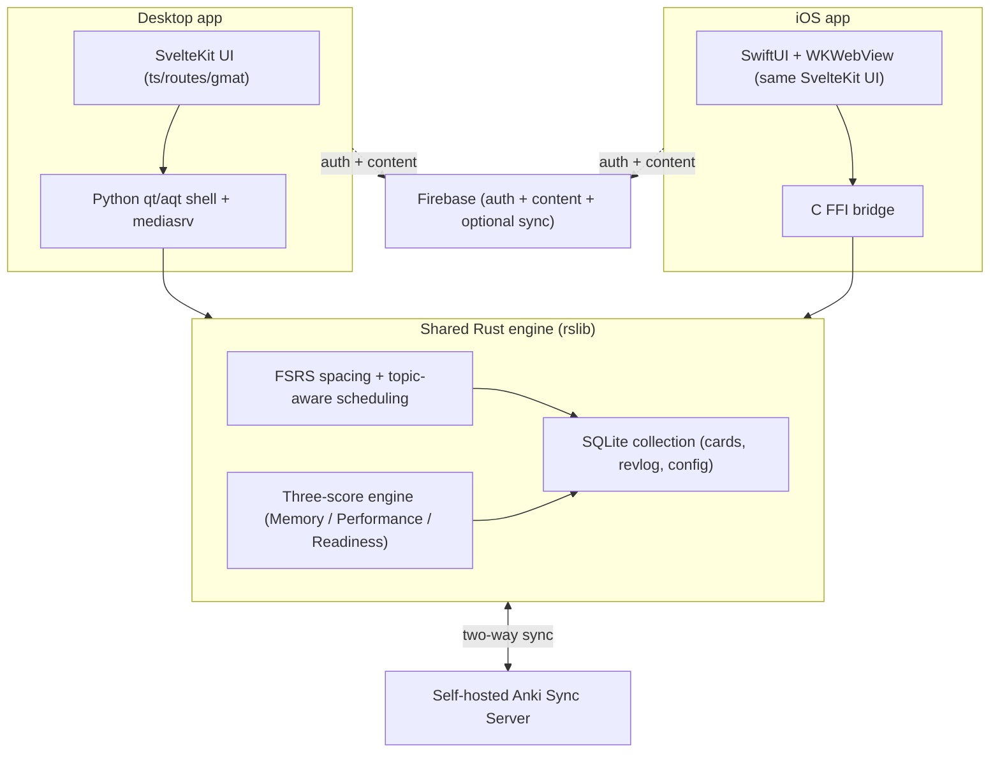

# GMATWiz

**An honest, structure-first GMAT Focus prep app built _inside_ a fork of Anki — one Rust learning engine shared by a desktop app and an iOS app.**

GMATWiz is a brownfield fork of [Anki](https://github.com/ankitects/anki): instead of bolting a quiz app on top, we edit Anki's own Rust/Python/TypeScript so its proven spaced-repetition + FSRS engine becomes a structured GMAT competence engine. It reports **three separate, honest scores** (Memory, Performance, Readiness) and refuses to show a number it can't back with evidence.

## Target exam

**GMAT Focus Edition** — scored **205–805** in **10-point steps**. Three sections, **45 minutes each**, each scored **60–90**:

- **Quantitative** (Problem Solving)
- **Verbal** (Critical Reasoning + Reading Comprehension)
- **Data Insights** (Data Sufficiency, Multi-Source Reasoning, Table Analysis, Graphics Interpretation, Two-Part Analysis)

**Current build scope:** Quant **Problem Solving** + Verbal **CR/RC** + Data Insights **multiple-choice** (Data Sufficiency / Two-Part Analysis / Multi-Source Reasoning). **Out of scope:** geometry and Data Sufficiency inside Quant, and **Sentence Correction** entirely (both removed in GMAT Focus). Data Insights' interactive, non-MCQ item types (Graphics Interpretation, Table Analysis) are deferred. The taxonomy is 37 leaf topics total — 18 Quant + 16 Verbal + 3 DI.

## Built on Anki (AGPL-3.0-or-later)

GMATWiz is a fork of **[Anki](https://github.com/ankitects/anki)** (this tree builds Anki `26.05`; base upstream commit `b00308e55`). All original Anki work is by **Ankitects Pty Ltd** and Anki contributors, and we are deeply grateful for it.

GMATWiz is licensed **AGPL-3.0-or-later**, the same as upstream Anki. Some upstream components are **BSD-3-Clause** (contributed by Anki users) and a few files carry other permissive licenses (MIT, Apache-2.0, CC BY 4.0) — all of those upstream license headers are **preserved unchanged**. See [`LICENSE`](./LICENSE) for the full terms and [`CONTRIBUTORS`](./CONTRIBUTORS) for attribution. Our own changes are kept additive and feature-gated to ease future merges with upstream.

## Two apps, one engine

The **desktop app is the primary tool**; the **iOS app is a companion** for review-on-the-go. They share the same cards, progress, scores, and — most importantly — the exact same engine, so a change to the scheduler or the scoring math ships to both platforms at once.

- **Rust engine (`rslib/`)** is the brain: FSRS spacing, our topic-aware scheduling, the SQLite collection, and the single implementation of the three scores. Shared _verbatim_ by both apps.
- **Desktop** is a Python `qt/aqt` shell hosting a **SvelteKit** UI in embedded webviews (the Python `mediasrv` answers the UI's requests and calls Rust).
- **iOS** embeds the **same SvelteKit UI** in a `SwiftUI` **`WKWebView`** and calls the shared Rust engine directly through a **C FFI** (Swift is UI-only; it never reimplements the scheduler).
- **Sync** is a **self-hosted Anki Sync Server** (`rslib/sync`) — the source of truth for reviews/scheduling/collection. **Firebase** handles auth + the question-bank content, plus optional cross-device config/collection sync; it is **not** the source of truth for scheduling.



## Build & run

> All commands run from the repo root: `cd anki-fork`.

### Desktop

```bash
./run
```

The **first** build is slow — it compiles the Rust engine, the Python wheels, and the SvelteKit UI from scratch (subsequent runs are incremental). The window opens directly on the GMATWiz screen. Then load the question bank once from the in-app menu: **Tools → Import GMAT content** (idempotent; safe to re-run).

### iOS (simulator)

The exact steps (from `context/update.txt` → "HOW TO RUN (Mobile)"):

```bash
xcodegen generate --spec ios/project.yml
xcodebuild -project ios/GMATWizPhone.xcodeproj -scheme GMATWizPhone \
  -sdk iphonesimulator -configuration Debug -derivedDataPath ios/build \
  -destination 'platform=iOS Simulator,name=iPhone 17' build
xcrun simctl boot "iPhone 17"; open -a Simulator
xcrun simctl install booted ios/build/Build/Products/Debug-iphonesimulator/GMATWizPhone.app
xcrun simctl launch booted com.gmatwiz.phone
```

> First time (or after any Rust/FFI or UI change), build the engine, bundle the web assets, and produce the xcframework first: `./ninja qt && bash ios/sync-resources.sh && bash ios/build-ios.sh` (see `context/update.txt` for the full mobile build block).

### Self-hosted sync server

```bash
./tools/gmat-sync-server.sh      # defaults: gmat:wiz @ 127.0.0.1:27811
```

The server must be running for desktop⇄phone sync to work. The desktop **Sync** button auto-targets it; the phone offers **Sync down** / **Sync up**.

## The three honest scores + the give-up rule

Every score obeys the **honesty rule**: it shows a point estimate, a likely **range**, a **"how sure"** confidence note, the **evidence** behind it, what data is still missing, and the best next thing to study — or it **abstains** and tells you exactly which conditions are unmet. Abstaining under threshold is itself correct, scored behavior, not a failure. All three are computed in one place ([`rslib/src/gmatwiz.rs`](./rslib/src/gmatwiz.rs)) and consumed identically by desktop and iOS.

| Score | Question it answers | Give-up rule (abstains until…) |
| --- | --- | --- |
| **Memory** | "Can you recall this right now?" (FSRS retention, proven calibrated) | **≥ 150 graded reviews** (`MEM_MIN_REVIEWS`) |
| **Performance** | "Can you answer a _new_, exam-style question?" (first-exposure attempts) | **≥ 50 application attempts** (`PERF_MIN_ATTEMPTS`); a per-topic weak spot needs **≥ 8** (`PERF_MIN_PER_TOPIC`) |
| **Readiness** | "What score would you get today, and how sure are we?" | **all four**: coverage **≥ 50%** (`READY_MIN_COVERAGE`) **and** **≥ 200 reviews** (`READY_MIN_REVIEWS`) **and** **≥ 50 attempts** (`READY_MIN_ATTEMPTS`) **and** memory calibration **ECE ≤ 0.10** (`READY_MAX_ECE`) |

Readiness is reported **per section** on the 60–90 scale, then composed into a **GMAT Focus Total (205–805)**. The **Total abstains until all three sections have evidence**, naming the sections that don't. It is calibrated against your real logged practice-test scores (a bias offset), and the raw heuristic is always shown alongside it. Full details: [`docs/models/memory.md`](./docs/models/memory.md), [`docs/models/performance.md`](./docs/models/performance.md), [`docs/models/readiness.md`](./docs/models/readiness.md).

## The required Rust engine change: topic-aware scheduling

**Goal:** surface **weak-topic cards first** while FSRS intervals stay valid and undo keeps working.

- **Mechanism A (reorder only).** When the queue is built, gathered **due review cards are stable-sorted by ascending per-card topic mastery**, so weaker topics come up first. Cards with no mastery set are treated as fully mastered and stay last. **FSRS memory state and stored intervals are never touched** — we change _what is surfaced_, not the algorithm. It's gated behind a `topicAwareScheduling` config switch (default off; also the ablation lever). See [`rslib/src/scheduler/topic_aware.rs`](./rslib/src/scheduler/topic_aware.rs) and `apply_topic_aware_order()` in the queue builder.

### Why Rust, not Python

The queue builder / scheduler is:

1. **Shared verbatim by desktop _and_ iOS** — Swift calls Rust, not Python, so a Python-side change simply would not exist on mobile.
2. **Performance-critical** — next-card selection must stay well under the p95 < 100 ms budget on a 50k-card deck.
3. **Transactional, undoable, and sync-safe** — all mutations go through `col.transact(Op, …)`; a Python bolt-on would break undo and the sync invariants.

### Files touched + merge difficulty

| File | Change | Merge difficulty |
| --- | --- | --- |
| `rslib/src/scheduler/topic_aware.rs` | **new** — `set_topic_mastery` op + tests | low |
| `rslib/src/scheduler/queue/builder/mod.rs` | `apply_topic_aware_order()` + read the toggle | moderate (upstream-active) |
| `rslib/src/storage/card/data.rs` | **additive** `CardData` field `topic_mastery` (no schema migration) | low |
| `rslib/src/deckconfig/` + `rslib/src/config/bool.rs` | `BoolKey::TopicAwareScheduling` toggle | low |

**Tests & proof:** 3 Rust unit tests for the required behaviors — (1) weak-topic cards are ordered ahead of strong-topic cards, (2) nothing reorders when the toggle is off, (3) stored FSRS `interval`/`due`/`ease` are byte-identical with the feature on vs off — plus an **undo** test, and **1 Python end-to-end test** ([`pylib/tests/test_gmatwiz.py`](./pylib/tests/test_gmatwiz.py)) that drives `set_topic_mastery` through the collection. **Undo + DB integrity verified.** (Captured logs: [`proof/rust-tests.txt`](./proof/rust-tests.txt), [`proof/python-test.txt`](./proof/python-test.txt).)

## Where the GMAT seam lives (files touched)

The whole GMAT feature set is an isolated seam over stock Anki:

- **Domain layer** — [`pylib/anki/gmatwiz.py`](./pylib/anki/gmatwiz.py): the 3 notetypes (GMAT PS / Verbal / DI) + idempotent importers (stem-hash dedup).
- **Desktop shell** — [`qt/aqt/gmat.py`](./qt/aqt/gmat.py): the GMATWiz screen/state, Tools-menu/toolbar wiring, versioned bundled-content import.
- **Desktop endpoints** — `gmat_*` handlers in [`qt/aqt/mediasrv.py`](./qt/aqt/mediasrv.py): overview, next/answer card, pretest, plan, today, calendar, error log, scores (delegates to Rust).
- **Shared engine** — [`rslib/src/gmatwiz.rs`](./rslib/src/gmatwiz.rs): the single source of truth for Memory / Performance / Readiness + the iOS endpoint port.
- **Engine change** — [`rslib/src/scheduler/topic_aware.rs`](./rslib/src/scheduler/topic_aware.rs).
- **Web UI** — [`ts/routes/gmat/`](./ts/routes/gmat/): the SvelteKit app (onboarding, Today, Study, Drill, Progress, Error Log) + Firebase auth/sync.
- **FFI + iOS** — [`ffi/`](./ffi/) (C FFI over the shared engine) and [`ios/`](./ios/) (SwiftUI + WKWebView host).
- **Content & lessons** — [`gmatwiz/content/`](./gmatwiz/content/) (taxonomy, scraper, question banks) and [`gmatwiz/lessons/`](./gmatwiz/lessons/) (authored micro-lessons).

Two invariants tie it together: every card/lesson/plan/score keys off a **section-aware topic id** `gmat::<section>::<category>::<leaf>`, and the score thresholds/shape are kept in **lock-step** between `rslib/src/gmatwiz.rs` (Rust/iOS) and `qt/aqt/mediasrv.py` (desktop).

## Reproduce / proof

The runnable proof pack lives in [`proof/`](./proof/): the commit under test, build/test logs, installer log, and the AI-eval write-up. Follow [`proof/RECORDING_GUIDE.md`](./proof/RECORDING_GUIDE.md) to reproduce the logs and capture the required recordings (clean build, installer on a clean machine, real phone review, phone→desktop sync).

## Further reading

- Product plan: [`PRD.md`](./PRD.md) · Codebase map: [`context.txt`](./context.txt) · Build state: [`context/update.txt`](./context/update.txt)
- Score model one-pagers: [`docs/models/`](./docs/models/) · Learning-science rationale: [`docs/BRAINLIFT.md`](./docs/BRAINLIFT.md)
- AI plumbing (built, **off by default**): [`AIfeatures.txt`](./AIfeatures.txt)

## License

GMATWiz is licensed **AGPL-3.0-or-later**. See [`LICENSE`](./LICENSE). It includes upstream Anki code (© Ankitects Pty Ltd and contributors) under AGPL-3.0-or-later with some BSD-3-Clause portions; all upstream license headers are preserved.
